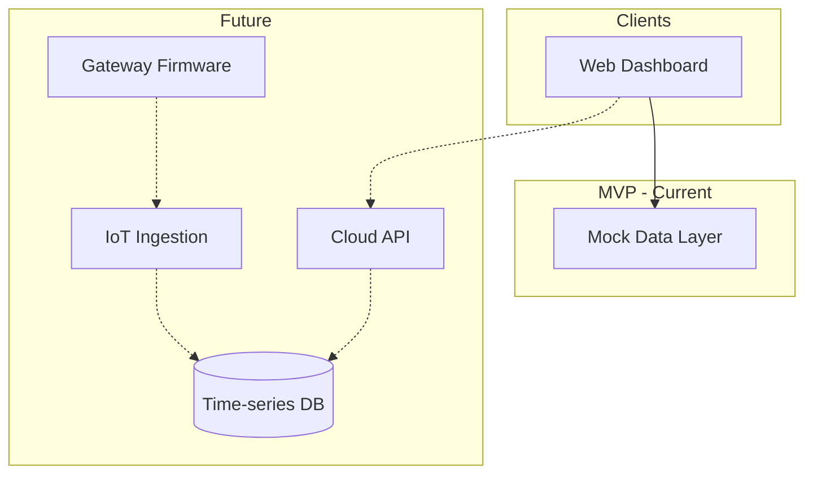
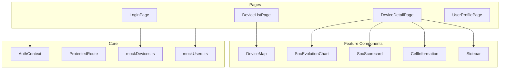
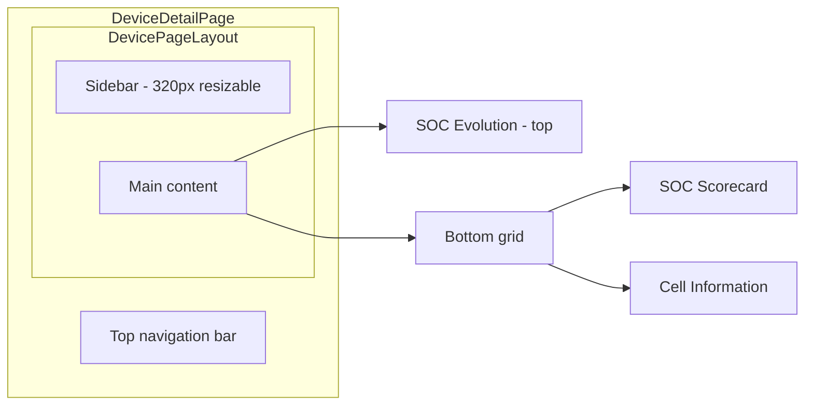
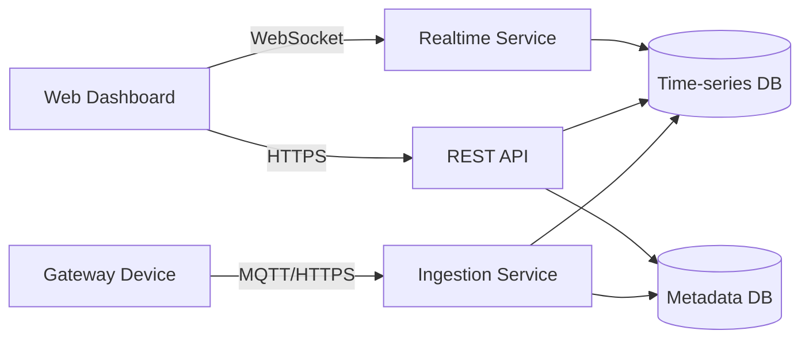

# Architecture Overview

## System context

## Repository structure

| Directory | Responsibility | Status |
|-----------|----------------|--------|
| `web/` | React SPA — fleet list, device detail, auth, profile | Implemented (MVP) |
| `cloud/` | Backend API, ingestion, alerting | Planned |
| `embedded/` | Gateway firmware, telemetry upload | Planned |
| `docs/` | Product and technical documentation | In progress |

## Web application architecture

### Tech stack

| Layer | Technology |
|-------|------------|
| Framework | React 19 + TypeScript |
| Build | Vite 8 |
| Routing | React Router 7 |
| Styling | Tailwind CSS 4 |
| Charts | Recharts |
| Maps | Leaflet + react-leaflet |
| Icons | Lucide React |

### Application layers

### Routing

| Path | Component | Auth required |
|------|-----------|---------------|
| `/login` | LoginPage | No |
| `/devices` | DeviceListPage | Yes |
| `/devices/:deviceId` | DeviceDetailPage | Yes |
| `/profile` | UserProfilePage | Yes |
| `/` | Redirect → `/devices` | — |

### Authentication flow (MVP)

1. User submits email/password on `/login`
2. `authenticateUser()` checks against `mockUsers`
3. On success, user object stored in `sessionStorage` via `AuthContext`
4. `ProtectedRoute` redirects unauthenticated users to `/login`
5. Logout clears session and navigates to `/login`

### State management

- **Global auth:** React Context (`AuthContext`)
- **Page-local state:** React `useState` (map selection, chart toggles, notification prefs)
- **Server state:** None in MVP (static mock imports)

### Key UI patterns

- **Card** — bordered white panels for dashboard sections
- **ResizableBlock** — CSS `resize` for adjustable panel dimensions
- **Accordion** — collapsible device details in sidebar
- **Badge / ProgressBar** — SOC and metric visualization

## Device detail layout

## Future cloud architecture (planned)

### Proposed cloud components

- **Ingestion service** — receive telemetry payloads from gateways
- **Metadata service** — device registry, groups, firmware versions
- **Query API** — REST/GraphQL for dashboard data
- **Realtime service** — WebSocket push for SOC and status changes
- **Alert engine** — threshold rules, notification dispatch

## Security considerations

### MVP (current)

- Mock credentials in source code (development only)
- Session in `sessionStorage` (cleared on tab close)
- No network calls for sensitive data

### Production (target)

- JWT or session cookies over HTTPS
- Role-based access control (Administrator vs Operator)
- Rate limiting on API
- Secrets in environment / vault, not source code
