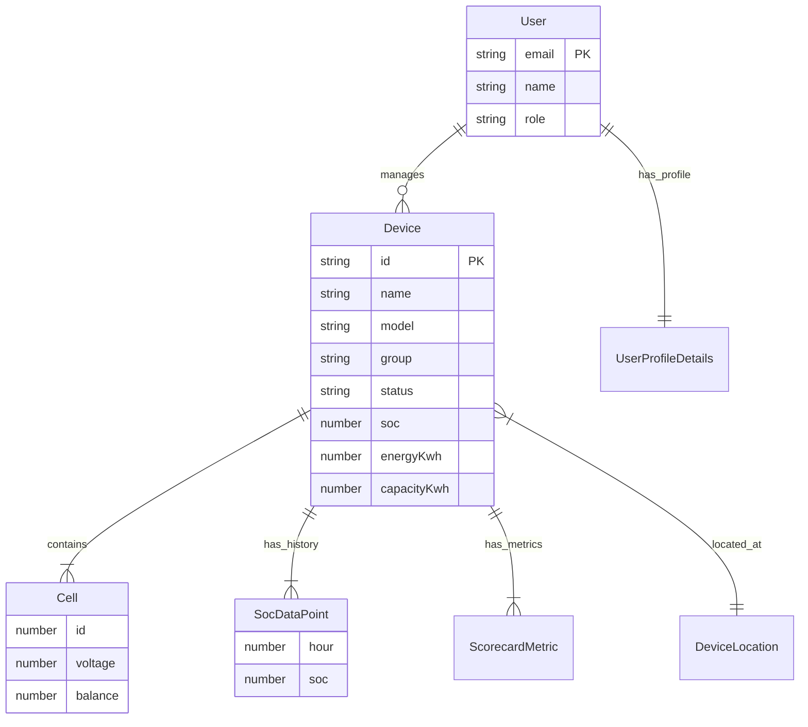

# Data Model

This document describes the core entities used by the Baruch IoT Platform. The MVP implements these as TypeScript interfaces with mock data in `web/src/data/`.

---

## Entity relationship diagram

---

## User

Represents an authenticated platform user.

| Field | Type | Description |
|-------|------|-------------|
| `email` | string | Unique login identifier |
| `password` | string | Credential (mock only; excluded from session storage) |
| `name` | string | Display name |
| `role` | string | `Administrator` or `Operator` |

**Source:** `web/src/data/mockUsers.ts`

### UserProfileDetails

Extended profile data keyed by email.

| Field | Type | Description |
|-------|------|-------------|
| `department` | string | Organizational unit |
| `phone` | string | Contact phone |
| `timezone` | string | User timezone |
| `joinedDate` | string | Account creation date |
| `lastLogin` | string | Last login timestamp |
| `managedDevices` | number | Count of devices under management |
| `notifications` | object | Email, SMS, weekly reports, offline alerts |

---

## Device

Represents a Baruch Gateway in the field.

| Field | Type | Description |
|-------|------|-------------|
| `id` | string | Unique device ID (e.g. `dev-01`) |
| `name` | string | Display name (e.g. `DEV-01`) |
| `model` | string | Hardware model (e.g. `Baruch Gateway X1`) |
| `age` | string | Device age in years |
| `group` | string | Fleet group (e.g. `Premium Fleet`) |
| `status` | enum | `online`, `warning`, or `offline` |
| `location` | DeviceLocation | Geographic position |
| `soc` | number | State of charge (0–100%) |
| `energyKwh` | number | Current energy (kWh) |
| `capacityKwh` | number | Total capacity (kWh) |
| `runtimeHours` | number | Estimated operating time (hours) |
| `lastUpdate` | string | Last telemetry timestamp |
| `firmware` | string | Firmware version |
| `hardware` | string | Hardware revision |
| `connectivity` | string | Connection mode (e.g. `LTE + Bluetooth`) |
| `chemistry` | string | Battery chemistry (e.g. `LiFePO4`) |
| `samplingInterval` | string | Sensor sampling interval |
| `uploadInterval` | string | Cloud upload interval |
| `monitoredPacks` | number | Number of battery packs |
| `packLabel` | string | Active pack label (e.g. `Pack A`) |
| `avgTemp` | number | Average cell temperature (°C) |
| `socHistory` | SocDataPoint[] | 24-hour SOC time series |
| `scorecardMetrics` | ScorecardMetric[] | Health metric rows |
| `cells` | CellData[] | Per-cell diagnostics |

**Source:** `web/src/data/mockDevices.ts`

### DeviceLocation

| Field | Type | Description |
|-------|------|-------------|
| `lat` | number | Latitude |
| `lng` | number | Longitude |
| `address` | string | Human-readable address |

### DeviceStatus

| Value | Meaning |
|-------|---------|
| `online` | Device reporting normally |
| `warning` | Degraded state (e.g. low SOC) |
| `offline` | No recent data |

---

## Telemetry

### SocDataPoint

Single point on the SOC evolution chart.

| Field | Type | Description |
|-------|------|-------------|
| `hour` | number | Hour offset (0–24) |
| `soc` | number | SOC percentage at that hour |

### ScorecardMetric

Health indicator shown in the SOC Scorecard panel.

| Field | Type | Description |
|-------|------|-------------|
| `id` | string | Unique metric key |
| `label` | string | Display label |
| `percent` | number | Score (0–100) |
| `status` | string | Human-readable status (e.g. `Good`, `23.6 h`) |
| `icon` | enum | `runtime`, `signal`, `balance`, `temperature`, `reporting` |

### CellData

Individual battery cell reading.

| Field | Type | Description |
|-------|------|-------------|
| `id` | number | Cell number (1–16) |
| `voltage` | number | Cell voltage (V) |
| `balance` | number | Balance position (0–1, for indicator dot) |

### Cell aggregate stats

Computed by `getCellStats(cells)`:

| Field | Type | Description |
|-------|------|-------------|
| `count` | number | Number of cells |
| `min` | number | Minimum cell voltage |
| `max` | number | Maximum cell voltage |
| `delta` | number | Max − min voltage |

---

## Mock data inventory (MVP)

### Users

| Email | Role | Password (dev only) |
|-------|------|---------------------|
| admin@baruch.io | Administrator | admin123 |
| operator@baruch.io | Operator | baruch2025 |

### Devices

| ID | Name | Group | Status | SOC |
|----|------|-------|--------|-----|
| dev-01 | DEV-01 | Premium Fleet | online | 68% |
| dev-02 | DEV-02 | Premium Fleet | online | 82% |
| dev-03 | DEV-03 | Standard Fleet | warning | 34% |
| dev-04 | DEV-04 | Standard Fleet | online | 91% |
| dev-05 | DEV-05 | Premium Fleet | online | 55% |
| dev-06 | DEV-06 | Standard Fleet | offline | 12% |
| dev-07 | DEV-07 | Premium Fleet | online | 74% |
| dev-08 | DEV-08 | Standard Fleet | online | 63% |

All devices share model `Baruch Gateway X1`, 75 kWh capacity, 16 cells, and LiFePO4 chemistry unless overridden in future seeds.

---

## Future API mapping (planned)

| MVP source | Future endpoint |
|------------|-----------------|
| `devices[]` | `GET /api/devices` |
| `getDeviceById(id)` | `GET /api/devices/:id` |
| `device.socHistory` | `GET /api/devices/:id/telemetry/soc?range=24h` |
| `device.cells` | `GET /api/devices/:id/cells` |
| `authenticateUser()` | `POST /api/auth/login` |
| `getUserProfile()` | `GET /api/users/me` |
