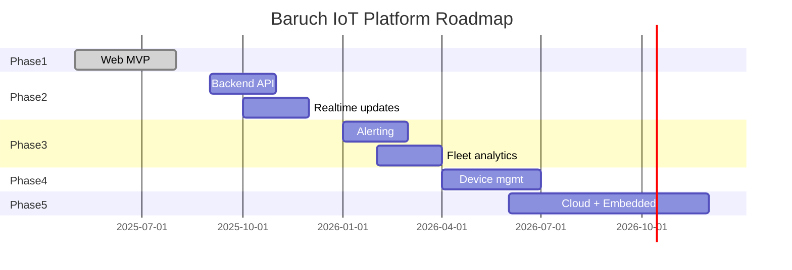

# Product Roadmap

Phased delivery plan for the Baruch IoT Platform.

---

## Phase 1 — Web MVP (current)

**Status:** In progress  
**Goal:** Validate UX and dashboard layout with mock data

| Deliverable | Status |
|-------------|--------|
| Login / logout with mock auth | Done |
| Device fleet list | Done |
| Fleet map (Leaflet) | Done |
| Device detail dashboard | Done |
| SOC evolution chart | Done |
| SOC scorecard | Done |
| Cell information panel | Done |
| User profile page | Done |
| Resizable dashboard panels | Done |
| Product documentation | Done |

---

## Phase 2 — Backend integration

**Goal:** Replace mock data with live API and real-time updates

| Feature | Description |
|---------|-------------|
| REST API | Device list, detail, telemetry queries |
| Authentication | JWT or session-based auth with secure storage |
| WebSocket | Push SOC and status updates to dashboard |
| Data migration | Align frontend models with API schema |
| Environment config | Dev/staging/prod API URLs |

**Exit criteria:** Dashboard displays live data for at least one pilot device.

---

## Phase 3 — Fleet operations

**Goal:** Operational features for day-to-day fleet management

| Feature | Description |
|---------|-------------|
| Alerting | SOC thresholds, offline detection, email/SMS notifications |
| Fleet devices overlay | Compare device SOC against fleet average on evolution chart |
| Device search and filters | Filter by group, status, SOC range |
| Export | CSV/PDF reports for SOC history and cell data |
| Multi-pack view | Switch between battery packs on cell information panel |

---

## Phase 4 — Device management

**Goal:** Configure and manage gateways from the platform

| Feature | Description |
|---------|-------------|
| Remote configuration | Update sampling/upload intervals |
| Firmware OTA | Schedule and track firmware updates |
| Device provisioning | Register new gateways, assign to groups |
| Audit log | Track configuration changes and user actions |

---

## Phase 5 — Cloud and embedded platform

**Goal:** End-to-end IoT stack

| Component | Directory | Description |
|-----------|-----------|-------------|
| Cloud API | `cloud/` | Ingestion, query, alerting services |
| Embedded firmware | `embedded/` | Gateway telemetry upload, local buffering |
| IoT ingestion | `cloud/` | MQTT/HTTPS device connectivity |
| Time-series storage | `cloud/` | SOC, voltage, temperature history |

---

## Technical debt and improvements

| Item | Priority | Notes |
|------|----------|-------|
| Remove password from in-memory user after login | High | Security hygiene before Phase 2 |
| Code-split Recharts/Leaflet bundles | Medium | Reduce initial bundle size (~790 KB) |
| Unit tests for data helpers | Medium | `getCellStats`, `getDeviceById` |
| E2E tests (Playwright) | Medium | Login, navigation, device detail |
| Mobile-responsive polish | Low | Optimize fleet list and detail for small screens |
| Dark mode | Low | Optional theme toggle |

---

## Milestone timeline (indicative)

*Timeline is indicative and subject to prioritization changes.*
